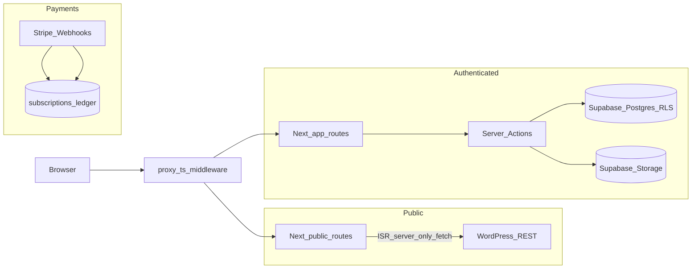

# SoloSheThings — project overview

**Purpose:** High-level map of the product, stack, routing, and how pieces connect. This file **synthesizes** and **links** to canonical sources; it does not replace them.

**Canonical orientation (read these for scope and backlog):**

- [DOCUMENTATION_INDEX.md](./DOCUMENTATION_INDEX.md) — topic map and one-source-of-truth rules
- [procedures/IMPLEMENTATION_ROADMAP.md](./procedures/IMPLEMENTATION_ROADMAP.md) — **what to build next**
- [MVP_STATUS_NOTION.md](./MVP_STATUS_NOTION.md) — **what is shipped** and progress history

---

## Mission and product shape

Per [ARCHITECTURE_CONSTITUTION.md](./ARCHITECTURE_CONSTITUTION.md), SoloSheThings is a **mobile-first** platform for solo female travelers: community connection, photo sharing, and travel-oriented resources—with **privacy and safety** emphasized (explicit selects, RLS everywhere, moderated UGC paths). **Subscription gates** tie to Stripe (trial + paid); **premium vs limited** entitlement is enforced from **database state**, not Stripe on every request ([contracts/BILLING_STRIPE_CONTRACT.md](./contracts/BILLING_STRIPE_CONTRACT.md), [`lib/billing/entitlements.ts`](../lib/billing/entitlements.ts)).

**Routes vs constitution examples:** Older constitution examples mention `talent/` and `client/` App Router folders. This repo uses **`(public)`**, **`(auth)`**, and **`(app)`** groups under [`app/`](../app/). Postgres still models roles as `talent`, `client`, `admin` on `profiles` ([database_schema_audit.md](./database_schema_audit.md)).

---

## Technology stack

Source: [`package.json`](../package.json).

| Layer | Choice |
|--------|--------|
| Framework | **Next.js 16** (App Router, **webpack** for `dev`/`build`) |
| UI | **React 18**, **Tailwind CSS 3**, **Radix Slot**, **Lucide**, **tw-animate-css**, **tailwind-merge** / **clsx** |
| Backend data | **Supabase** (`@supabase/supabase-js`, `@supabase/ssr`) |
| Editorial | Optional **WordPress** headless REST + ISR + revalidation ([WORDPRESS_SUPABASE_BLUEPRINT.md](./WORDPRESS_SUPABASE_BLUEPRINT.md), [contracts/WORDPRESS_CONTENT_CONTRACT.md](./contracts/WORDPRESS_CONTENT_CONTRACT.md)) |
| Billing | **Stripe** (`stripe` SDK), webhook [`app/api/webhooks/stripe/route.ts`](../app/api/webhooks/stripe/route.ts) |
| Email | **`resend`** in deps; outbound marketing automation is intentionally **bounded** ([contracts/EMAIL_NOTIFICATIONS_CONTRACT.md](./contracts/EMAIL_NOTIFICATIONS_CONTRACT.md), roadmap). |
| HTML safety | **`sanitize-html`** for WordPress HTML |
| Observability | **`@sentry/nextjs`** + structured server logging (`lib/server-log.ts`, `lib/supabase-errors.ts`) |
| Types | **TypeScript strict**; generated DB types under [`types/`](../types/) |

---

## How the system fits together

**Responsibilities:**

- **WordPress** — public editorial/SEO content only; Next reads it **server-side** with graceful behavior if `WP_URL` is absent ([ARCHITECTURE_CONSTITUTION.md](./ARCHITECTURE_CONSTITUTION.md)).
- **Supabase** — Auth, profiles, subscription mirror, `community_posts`, `post_images`, `saved_posts`, `reports`, moderation RPCs/admin reads, `community_post_reads`, `marketing_interest`, Stripe webhook ledger, Storage for uploads ([database_schema_audit.md](./database_schema_audit.md), [DATABASE_REPORT.md](./DATABASE_REPORT.md)).

Canonical behavior: [`docs/contracts/`](./contracts/).

---

## Routing and execution model

**Auth:** Session refresh + `getUser()` + redirects live in **[`proxy.ts`](../proxy.ts)** ([contracts/AUTH_CONTRACT.md](./contracts/AUTH_CONTRACT.md)).

**Protected prefixes** include `/dashboard`, `/profile`, `/submit`, `/places`, `/saved`, `/reports`, `/subscribe`, `/admin`, and others listed in `proxy.ts`.

| Zone | Example routes | Purpose |
|------|----------------|--------|
| Public | `/`, `/about`, `/pricing`, `/blog`, `/blog/[slug]`, `/contact`, `/collections`, `/map`, … | Marketing + optional WP + stubs |
| Auth | `/login`, `/signup` | Sign-in/up |
| Authenticated app | `/dashboard`, `/profile`, `/submit`, `/places`, `/places/[slug]`, `/saved`, `/reports`, `/subscribe`, … | Community + billing |
| Admin | `/admin/moderation` | Platform admins (`profiles.role === 'admin'`) |

Default to **Server Components** for data; mutations use **`app/actions/*.ts`** server actions ([`app/actions/`](../app/actions/)).

---

## Domain snapshot (detail lives in MVP doc)

Shipped breadth is maintained in **[MVP_STATUS_NOTION.md](./MVP_STATUS_NOTION.md)** (canonical). At a glance: hardened auth, profiles + Storage avatars, community submit/browse/save/report/moderation, owner lifecycle on stories, Stripe tiers + read caps, marketing-interest capture (no ESP automation yet), Sentry/product signals where configured.

---

## Before feature work — contracts and route gates

Verify behavior against contracts (and **`proxy.ts` matchers**) when changing auth surfaces, queries, uploads, billing, or WordPress:

| Topic | Canonical doc |
|--------|----------------|
| Auth / session | [contracts/AUTH_CONTRACT.md](./contracts/AUTH_CONTRACT.md) |
| Public vs signed-in surfaces | [contracts/PUBLIC_PRIVATE_SURFACE_CONTRACT.md](./contracts/PUBLIC_PRIVATE_SURFACE_CONTRACT.md) |
| Queries / RLS | [contracts/DATA_ACCESS_QUERY_CONTRACT.md](./contracts/DATA_ACCESS_QUERY_CONTRACT.md) |
| Uploads / Storage | [contracts/UPLOADS_STORAGE_CONTRACT.md](./contracts/UPLOADS_STORAGE_CONTRACT.md) |
| Stripe / entitlement | [contracts/BILLING_STRIPE_CONTRACT.md](./contracts/BILLING_STRIPE_CONTRACT.md) |
| Route protection list | [`proxy.ts`](../proxy.ts) |

---

## Database schema discipline

- Add schema only via **`supabase migration new <description>`** — never rewrite applied migrations ([MIGRATION_PROCEDURE.md](./procedures/MIGRATION_PROCEDURE.md), user/repo migration rules).
- After schema changes: regenerate types (`supabase gen types typescript …` → `types/database.ts` per audit doc) and update **[database_schema_audit.md](./database_schema_audit.md)** when **schema truth** changes.

---

## Deploying schema — operational priority

Until hosted migration CI is reliable, prioritize **[procedures/SOLOSHETHINGS_SUPABASE_CICD_RECOVERY_WORK_ORDER.md](./procedures/SOLOSHETHINGS_SUPABASE_CICD_RECOVERY_WORK_ORDER.md)** alongside [IMPLEMENTATION_ROADMAP.md](./procedures/IMPLEMENTATION_ROADMAP.md).

---

## Doc/code alignment notes

- Treat **[`app/`](../app/)** as the route layout source of truth over older `talent/` / `client/` folder sketches in narrative docs.
- [WORDPRESS_SUPABASE_BLUEPRINT.md](./WORDPRESS_SUPABASE_BLUEPRINT.md) may still say “planned” in places; live WP behavior is governed by **[WORDPRESS_CONTENT_CONTRACT.md](./contracts/WORDPRESS_CONTENT_CONTRACT.md)** plus blog/revalidate routes in the app.

---

## Engineering checklist (quick)

- Orientation: `DOCUMENTATION_INDEX.md` → `IMPLEMENTATION_ROADMAP.md` → `MVP_STATUS_NOTION.md`
- Security read: `PROJECT_CONTEXT_PROMPT.md`, `SECURITY_INVARIANTS.md`
- Quality gates: `npm run typecheck`, `npm run lint`, `npm run build` ([MVP_STATUS_NOTION.md](./MVP_STATUS_NOTION.md) verification section)
